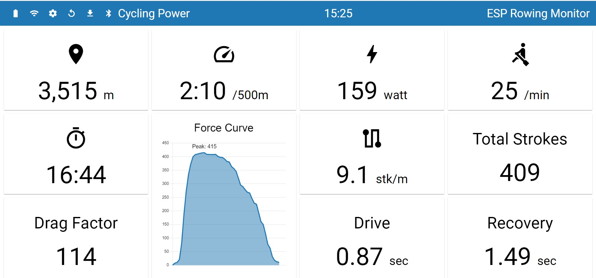
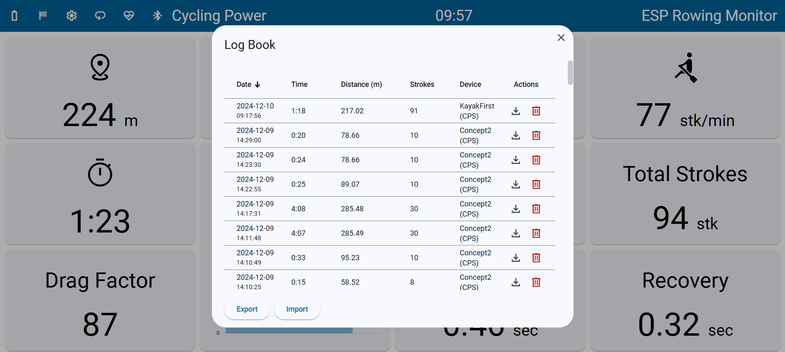
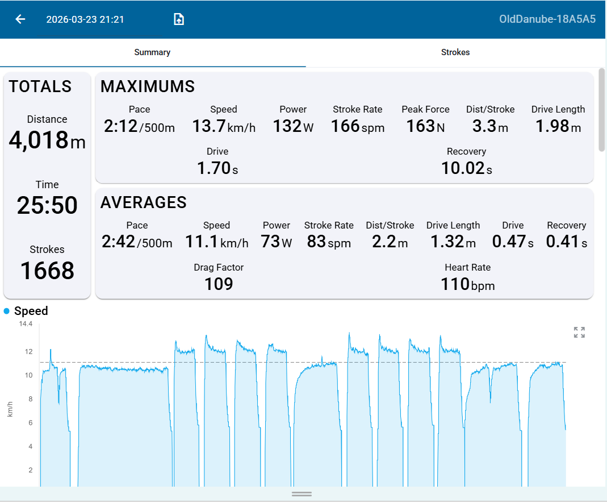

# ESP Rowing Monitor WebGUI

ESP Rowing Monitor WebGUI is an installable Progressive Web App for [ESP Rowing Monitor](https://github.com/Abasz/ESPRowingMonitor). It provides the live dashboard, device settings, logbook, session analysis, firmware update flow, and export/import tools in a browser-based UI.

The recommended way to use the app is the hosted PWA on [GitHub Pages](https://abasz.github.io/ESPRowingMonitor-WebGUI). Hosting the GUI on HTTPS avoids the secure-context problems that affect browser APIs such as Web Bluetooth and WebUSB, and it allows the app to update independently from the firmware.

## Compatibility

- The hosted PWA requires ESP Rowing Monitor firmware with the Extended BLE Metrics API, which means ESPRM 5.2.0 or newer.
- The GitHub Pages build does not support the deprecated WebSocket-based workflow.
- Historical notes for manually serving older WebSocket-era builds are kept in [docs/deprecated-docs.md](docs/deprecated-docs.md).

## Current Capabilities

### Live dashboard

- Real-time metrics dashboard with configurable unit system.
- Drag-and-drop dashboard layout editor in Settings.
- Separate portrait and landscape layouts, with optional orientation lock.
- Sliding moving average smoothing for displayed metrics.
- Support for Speed, Peak Force, Drive Length, and other rowing metrics.

### Session control

- Manual start and stop session control.
- Pause and resume support without losing session state.
- Optional auto-start when a new stroke is detected.
- Accurate elapsed-time tracking backed by a dedicated stopwatch implementation.

### Logbook and session analysis

- Local session storage in IndexedDB.
- Logbook table with session metadata and export actions.
- Dedicated session detail page with summary metrics, time-series charts, lap table, and per-stroke inspection.
- Session switcher inside the analysis view so recorded sessions can be opened without going back to the dashboard.
- JSON import directly into the session detail view.

### Export and import

- FIT file export for platforms such as Strava or Garmin Connect.
- CSV export with detailed per-stroke data, including elapsed time, distance, pace, power, stroke rate, drive and recovery durations, heart rate, drag factor, peak force, drive length, and handle forces.
- JSON export and import for backup, transfer, and offline analysis.
- Native Web Share API support on supported devices, with file download fallback on desktop browsers.
- Export of runtime rowing settings as a C++ header file for ESPRM firmware builds.

### Firmware update flow

The WebGUI includes a built-in firmware update manager that simplifies device firmware update process. It provides:

- Automatic firmware update check after connecting to a device.
- Firmware profile download sourced from ESPRowingMonitor releases.
- Hardware-profile selection for supported boards.
- OTA firmware update directly from the browser.

## Browser and Device Notes

### BLE heart rate monitor support

The app supports BLE heart rate monitors through the Web Bluetooth API. Once enabled in Settings, a heart icon appears in the toolbar and can be used to pair and reconnect to a monitor.

Known limitations:

- Chrome on Windows and Android is the primary tested environment.
- iOS browsers do not expose Web Bluetooth because of platform restrictions. A browser such as [Bluefy](https://apps.apple.com/us/app/bluefy-web-ble-browser/id1492822055) is required there.
- macOS Web Bluetooth support depends on browser and platform support and has seen limited testing.
- Some Chrome installations may require enabling `chrome://flags/#enable-web-bluetooth-new-permissions-backend` for reconnect behavior.

### ANT+ heart rate monitor support

The app also supports ANT+ monitors through the WebUSB API. On Windows, the ANT+ USB dongle must use a WinUSB-compatible driver rather than a generic libusb driver. [Zadig](https://zadig.akeo.ie/) can be used to install the correct driver.

## Storage Behavior

The logbook is stored locally in the browser using IndexedDB. That makes it fast and fully offline-capable, but it is still local browser storage rather than a cloud-synced database.

The app attempts to request persistent storage through the StorageManager API when the browser supports it. This reduces the risk of the browser evicting stored sessions under disk pressure, but it is still subject to browser and OS policy.

Due to the above, it is recommended to do export of the database regularly to prevent potential data loss (or upload to training platform). Please see [Export and Import section](#export-and-import).

For more background, see [Dexie StorageManager docs](https://dexie.org/docs/StorageManager) and [this overview of the Storage API](https://hackernoon.com/persistent-data-what-working-with-the-storage-api-looks-like).

## Backlog

- Add calibration support to the UI.
- Make recorded sessions replayable, especially force curves.
- Add a browser-based firmware flasher over WebSerial for first-time setup.
