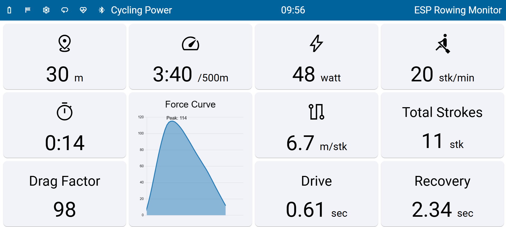

# ESP Rowing Monitor WebGUI

The purpose of this project is to provide an intuitive WebGUI for [ESP Rowing Monitor](https://github.com/Abasz/ESPRowingMonitor), designed to simplify metrics tracking, settings management and firmware updates.

The WebGUI may be accessed via [GitHub Pages of this Repo](https://abasz.github.io/ESPRowingMonitor-WebGUI) directly as an installable Progressive Web App (with all its features) eliminating the need of running local developer/other server or host the page on the ESP32 MCU, building the Web GUI and so on. This means that this app, after install from the browser, can be used and accessed like a native app on Windows/IOS/Android with home screen icon, updates are pushed automatically, etc. This method provides a much simpler way of distributing this app.

The WebGUI supports all features of ESPRM API (i.e. it is able to take full advantage of the Extended BLE Metrics API as well as supports over-the-air firmware updates).

This approach solves several issues that has been encounter with the distribution method (e.g. its accessed through https so secured context is not an issue). Updates to the WebGUI can this way be pushed automatically and no longer requires recompilation and uploading to the MCU, etc.

**Note, the version served over the GitHub Pages is only compatible with version 5.2.0 and above of ESP Rowing Monitor. This is due to the fact that the WebGUI served via GitHub Pages do not work with the deprecated WebSocket based connection type (the issue is the lack of connection via ssl to the MCU and browser security prevents such connection, at least on chrome), i.e. it requires the Extended BLE service introduced in version 5.2 of ESPRM. Starting with v7.0.0, the WebGUI has updated its BLE API implementation to align with the latest ESPRM firmware changes, including support for 16-bit drag factor and deprecated settings fields (for now still keeping backward compatibility).**

For reference, the old README that related to the manual building and serving/hosting of the WebGUI have been moved [here](docs/deprecated-docs.md)

## BLE Heart Rate Monitor Support

The WebGUI supports BLE HR monitors that can be enabled in the setting. Once that is done a heart icon will show up on the toolbar that enables connecting to the HR monitor (user needs to click and then select the device from the popup window). The implementation uses Web Bluetooth API.

The WebGUI supports auto reconnect to previously paired device (reconnects to the one that was last connected) without the need to open the dialog.

However currently there are several limitations:

- Theoretically any browser (with sufficient high version) should work that supports the Web Bluetooth API. However, it has mostly been tested in Chrome (Windows and Android) and on iPhone XR (though not in native browsers like Safari or Chrome, etc.)
- WebGUI does not work on iOS in Chrome or Safari because they do not support Web Bluetooth API on the device level for browsers. To have the GUI working, a special browser supporting the Web Bluetooth API like [Bluefy](https://apps.apple.com/us/app/bluefy-web-ble-browser/id1492822055) is necessary.
- While theoretically MacOS support Web Bluetooth API, there are reports that the WebGUI does not work on MacOS in any browser (report if this is not the case). I dont have the hardware to test this.
- For Chrome at least (but I suspect other browsers may too) require the `chrome://flags/#enable-web-bluetooth-new-permissions-backend` to be enabled for the reconnect feature to work correctly

## ANT+ Heart Rate Monitor Support

The WebGUI supports ANT+ HR monitors that can be enabled in the setting. Once that is done a heart icon will show up on the toolbar that enables connecting to the HR monitor (user needs to click and then select the device from the popup window). The implementation uses Web USB API.

However the ANT+ needs a WinUSB driver (instead of generic libusb) otherwise itt will not work. This can be installed with [Zadig](https://zadig.akeo.ie/).

## Export Options for Workout Data

The WebGUI provides multiple export formats for logged workout data:

- **TCX Export**: Export sessions in TCX format for manual upload to Strava and other fitness platforms.
- **CSV Export**: Export detailed per-stroke data in CSV format (along with delta times), including elapsed time, distance, pace, power, stroke rate, drive/recovery durations, heart rate, drag factor, peak force, and handle forces. This is ideal for detailed analysis and data processing.
- **JSON Export**: Export session data and delta times in JSON format for backup or custom processing.
- **Web Share API Integration**: On supported mobile devices, you can share exported files directly using the native share functionality, with automatic fallback to traditional downloads on desktop.

## Experimental Logbook support

The GUI is capable of persisting sessions. However, this is saved to the browser storage which means that it is not transferable between devices automatically. Nevertheless, the GUI provides for an import/export feature that helps with moving the data between devices if necessary.

_Limitations:_

Even though the Logbook is saved to a fully functional client-side database (IndexedDB) for the web, it is not a persistent storage by default. IndexedDB without StorageManager is just a “best-effort” database that can be erased in situations of low disk space on a device. The browser may delete your database without notifying the user in case it needs to free up space for other website’s data that was used more recently than yours.

It is possible to request via the StorageManager API to persist the data and prevent accidental deletion but this is not perfect as there is no guarantee that persistence can be enabled (its up to the browser, system whether system got permission etc.).

For further information please see the [here](https://dexie.org/docs/StorageManager) and [here](https://hackernoon.com/persistent-data-what-working-with-the-storage-api-looks-like)

## Firmware Update Manager

The WebGUI now includes a built-in firmware update manager that:

- Automatically checks for firmware updates when connecting to a device
- Downloads firmware profiles directly from the ESPRowingMonitor GitHub releases
- Provides a UI for selecting the appropriate firmware profile for your hardware
- Supports over-the-air (OTA) firmware updates directly from the browser

This feature eliminates the need to manually download firmware files and simplifies the update process for users.

## Backlog

- Implement calibration feature within the UI
- Make sessions repayable, especially the force curves
- Add web firmware flasher with WebSerial to support initial from scratch setup of devices solely from the browser (i.e. drop the requirement of using separate tools for flashing the device)
